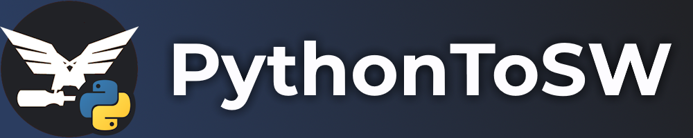

## 📚 | Overview
PythonToSW is a Python package that allows you to create addons in Stormworks: Build and Rescue with Python through HTTP using FastAPI under the hood.

### Working Example
```python
from PythonToSW import (
    Addon,
    CallEnum,
    CallbackEnum
)

class State():
    """
    Represents addon state.
    This is not required for PythonToSW.
    This is purely for the addon.
    """
    
    ticks = 0
    count = 0

addon = Addon("Testing", path = ".", port = 2000)
state = State()

def on_player_join(steam_id: int, name: str, peer_id: int, is_admin: bool, is_auth: bool):
    """
    Called when a player joins.
    """
    
    addon.call(CallEnum.ANNOUNCE, "My Addon", f"Welcome {name}!")

def on_tick():
    """
    Called every tick.
    """
    
    state.ticks += 1
    
    if state.ticks % 100 != 0: # Only run below code every 100 ticks
        return
    
    state.count += 1
    addon.call(CallEnum.NOTIFY, -1, "My Addon", f"We at #{state.count}", 1)

def on_start():
    """
    Called when the addon starts.
    """
    
    players: dict = addon.call(CallEnum.GET_PLAYERS)[0]

    for player in players:
        on_player_join(
            player["steam_id"],
            player["name"],
            player["id"],
            player["admin"],
            player["auth"]
        )
    
    # lua code equivalent: server.announce("My Addon", "Addon has started!")
    addon.call(CallEnum.ANNOUNCE, "My Addon", "Addon has started!")

# Listen for players joining
addon.connect(CallbackEnum.ON_PLAYER_JOIN, on_player_join)

# Connect `on_tick` function to the custom `on_tick` event
# This does not connect to the in-game `onTick` callback (intentionally not allowed)
addon.on_tick += on_tick

# Start the addon. `on_start` will then be called when it is fully started
addon.start(on_start)
```

## ⚙️ | Installing this package
- Use `pip install PythonToSW --upgrade`
- Import the package with `import PythonToSW as PTS` in your code

## ✅ | Advantages
- Since the addon is running outside of the game, you get much more control with your addon and aren't limited by the limitations of Stormworks Lua.
    - You can send HTTP requests to places other than localhost, and using methods other than `GET`.
    - You can write to/read from files.
    - ... and so on.
- Classes (since we're using Python here)
- The source code of your addon can't be accessed via malicious actors.
    - Yup. If someone with malicious intent is in a server with an addon, they can get the addon's raw code (although difficult to do).
    - Because PythonToSW uses HTTP and doesn't compile code to Lua, the Python source code is completely hidden and the only code malicious actors can get is the Lua code that connects to the PythonToSW server (which is already open-source).

## ❌ | Disadvantages
- Noticeable delays. This project works through HTTP instead of converting Python code to Lua code, and HTTP is unfortunately slow (limited to one request every two ticks, aka 32 requests/sec).
- For your addon to function, the host of the server must run the Python script behind your addon. Closing the Python script will essentially stop the addon.
- Uploading your addon to the workshop is pointless as the Python code is what makes your addon work. Distributing your addon therefore becomes harder and less convenient for users to download and use.

## ✨ | Credit
- **Cuh4** ([GitHub](https://github.com/Cuh4)) 