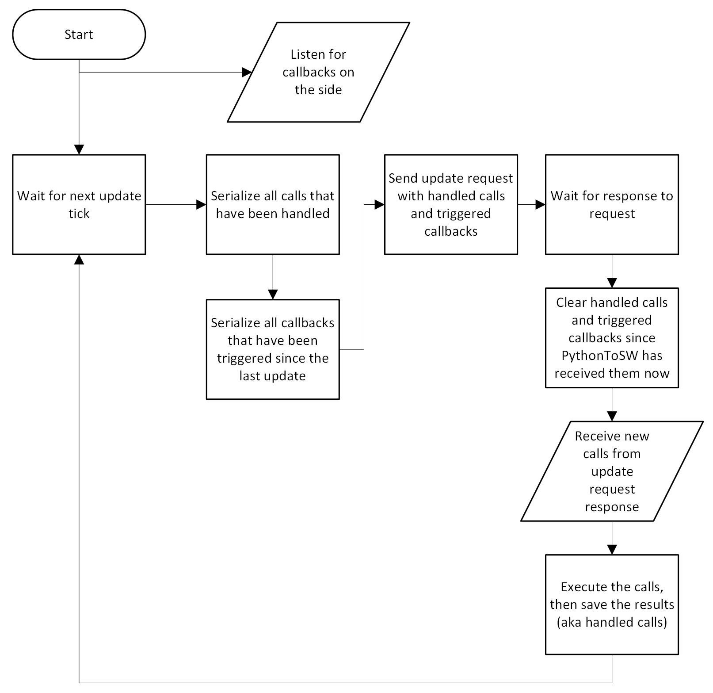

# Behind The Scenes


Not everything will be covered here. If you're truly curious, the code is open-source so feel free to [check it out here](https://github.com/Cuh4/PythonToSW).


## Key Terms

`SWToPython`: The in-game addon. This is ran in-game on the Lua side.

`In-Game Addon`: See above. Same as SWToPython.

`Addon`: Your PythonToSW addon on the Python side.

`Call`: A call to a function within the in-game addon, sent by your addon.

`Handled Call`: A call that has been executed and the results have been returned back to your addon.

`In-Game Callback`: A game event, like a player joining (`onPlayerJoin`).

## Calls

Whenever you use `addon.call`/`addon.call_function`, this adds a `Call` to a queue.

SWToPython will constantly send an update request to your addon 32 times/s to fetch the queue, send over callbacks that have been triggered, etc.

It will then execute all calls in the queue in order by finding the functions and calling them with the specified arguments, which then it will return the results in the next update.

## Callbacks

Whenever an in-game callback, like `onPlayerJoin` is triggered, it is added to a queue. In the next update sent by SWToPython, it will pass along the triggered callbacks and the arguments they were triggered with, which then your PythonToSW addon will pick up and trigger any connections to the callbacks you have created, if any.

## Addon Creation

When you start your PythonToSW addon, it will automatically create files and folders required by the game to make your addon function. If you specify a path to an addon for the `copy_from` argument of the `Addon` class, it'll copy over the data from that addon too (zones, vehicles, etc.).

As for `DedicatedServerAddon`, it'll do the same but automatically update your `server_config.xml` file to accommodate the addon too. It'll also automatically set the addon storage path (`rom/data/missions` in your dedicated server directory).

## Flowcharts


These flowcharts are as of v2.0.0. The logic may deviate from the flowcharts in future versions, but the core logic likely still holds up.


### PythonToSW

<figure><figcaption></figcaption></figure>

### SWToPython

<figure><figcaption></figcaption></figure>
