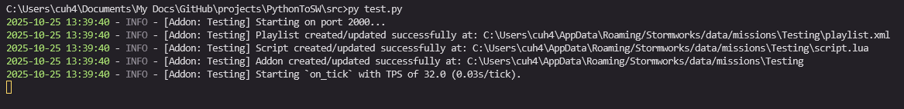

# Your First Addon

## Importing PythonToSW

Before we begin with creating an addon, we need to first import PythonToSW.


Ensure you have installed the PythonToSW package before proceeding (see [..](../ "mention")).



```python
from PythonToSW import (
    Addon,
    CallEnum,
    CallbackEnum,
    AddonConstants
)
```


There are more things we can import, but these four are the the only things relevant to the guide.

## Creating The Addon

As shown in the import code, we imported `Addon` which is a class representing a PythonToSW addon. To create an addon, we simply create an instance of this class like so:


```python
addon = Addon(
    "My Addon",
    path = ".",
    port = 2500
)
```


This will create an addon which runs on port 2500, and will store addon-related data at `.` .


If you're not on Windows and your Stormworks' addon directory is therefore not in `%appdata%/Stormworks/data/missions`, you can override it to where it should be with the `addons_path` argument.


```python
addon = Addon(
    "My Addon",
    path = ".",
    port = 2500,

    addons_path = "path/to/stormworks/addon/directory"
)
```




There are also additional arguments you can pass (excluding the aforementioned `addons_path`):

`force_new_token`: Defaults to `False`. If `True`, a new token will be generated every time the addon starts. This isn't recommended to be `True` when you're developing an addon, otherwise you'd have to constantly run `?reload_scripts` in-game every time you stop and start the addon.

`constants`: See [modifying-addon-constants.md](modifying-addon-constants.md "mention").

`uvicorn_log_level`: The log level for Uvicorn. Uvicorn is what runs the FastAPI server behind the scenes. Defaults to show warnings only (`logging.WARNING`).

`copy_from`: A path to an actual Stormworks addon. This will copy the `playlist.xml` and any vehicle files over to this addon. Useful if you want to add locations, vehicles, zones, etc, into your PythonToSW addon.


## Starting The Addon

PythonToSW addons comes with three built-in events, which include:

* `on_start`: Fired when the in-game addon connects to your PythonToSW addon.
* `on_stop`: Fired when the in-game addon disconnects from your PythonToSW addon (e.g. game exited).
* `on_tick`: Called every tick at a default rate of 32 ticks/s, only if connected. More on this in a future page.

To start the addon, we need to call the `.start()` method land optionally pass in functions for `on_start` and `on_stop`.


```python
addon = Addon(
    "My Addon",
    path = ".",
    port = 2500
)

def on_start():
    """
    Called when the addon starts (connects with in-game addon).
    """
    
    pass
    
def on_stop():
    """
    Called when the addon stops (disconnects with in-game addon).
    """
    
    pass
    
addon.start(on_start, on_stop)
```



You can also do it like so:

```python
addon.on_start += on_start
addon.on_stop += on_stop

addon.start()
```

Whatever floats your boat!


This will then automatically setup the addon and run a localhost server as you'll see in your terminal.

<figure><figcaption></figcaption></figure>

You'll also notice a `.json` file gets created at the path you provided for the `path` argument. This simply contains data for your addon that needs to persist, like request tokens.

## Finished

Congratulations, you have created your first addon!

Start up a world in Stormworks and look through your addons, you'll notice an addon with the name `(PTS) My Addon` (or whatever you named your addon). If you enable it and start up the world, you'll see "(addon name) has connected." in your terminal and all should work!
